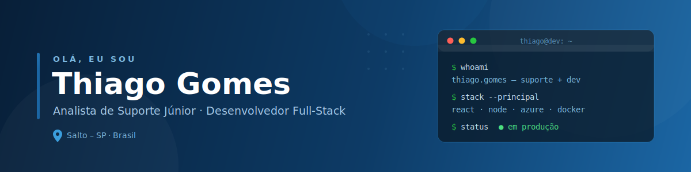
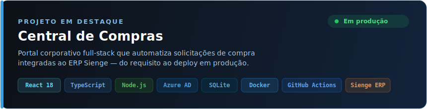

<p align="center">
  
  
  
  
</p>

<p align="center">
  <a href="https://www.linkedin.com/in/thiago-gomes-dev/">
    
  </a>&nbsp;
  <a href="mailto:thigogo3@gmail.com">
    
  </a>&nbsp;
  <a href="https://github.com/Thiago-A-Gomes">
    
  </a>
</p>

---

### Sobre mim

```yaml
nome: Thiago Aparecido Gomes
formacao: Bacharel em Analise e Desenvolvimento de Sistemas — CEUNSP
cargo: Analista de Suporte Junior
experiencia_anterior: Estagiario de TI — John Deere BR
localizacao: Salto - SP
idiomas: [Portugues (nativo), Ingles (corporativo), Espanhol (intermediario)]
```

Formado em **Analise e Desenvolvimento de Sistemas** pela CEUNSP. Atuo como Analista de Suporte Junior em uma MSP atendendo empresas do setor de construcao civil e investimentos. Alem do suporte, desenvolvo aplicacoes web internas do zero — do levantamento de requisitos ao deploy em producao, integrando ERPs, autenticacao corporativa e CI/CD automatizado.

Passei pela **John Deere BR** como estagiario de TI, onde trabalhei com suporte a sistemas, integracao entre plataformas, automacao de rotinas e metodologias ageis (Scrum/Kanban).

---

### Experiencia

<table>
<tr>
<td width="90" align="center">
  
</td>
<td>
  <strong>Analista de Suporte Junior</strong><br>
  <sub>Suporte analitico, administracao Office 365, Windows Server, Azure, monitoramento Ncentral/3CX, manutencao de hardware, redes e telecomunicacoes. Desenvolvimento de aplicacoes web internas.</sub>
</td>
</tr>
<tr>
<td width="90" align="center">
  
</td>
<td>
  <strong>Estagiario de TI</strong> — John Deere BR<br>
  <sub>Suporte a sistemas, integracao entre plataformas, automacao (JavaScript, Python, PL/SQL, Shell Script), documentacao tecnica, backup/restore, Scrum e Kanban.</sub>
</td>
</tr>
</table>

---

### Projeto em destaque

<a href="https://github.com/Thiago-A-Gomes/Central-de-compras">
  
</a>

<p align="center">
  <a href="https://github.com/Thiago-A-Gomes/Central-de-compras">
    
  </a>
</p>

---

### Tecnologias e ferramentas

<p align="center">
  
</p>

---

### O que eu faço

<table>
<tr>
<td width="33%" valign="top">

**Desenvolvimento**
- Aplicacoes web full-stack
- React + TypeScript + Node.js
- Integracoes com ERPs e APIs REST
- Autenticacao corporativa (Azure AD)
- CI/CD com Docker + GitHub Actions
- Bancos: SQLite, PostgreSQL, MySQL, Oracle, SQL Server

</td>
<td width="33%" valign="top">

**Infraestrutura e Cloud**
- Microsoft Azure (AZ-900 + AZ-104)
- AWS e Google Cloud
- Administracao Office 365
- Windows Server
- Servidores Linux
- Containers Docker

</td>
<td width="33%" valign="top">

**Suporte e Redes**
- Monitoramento Ncentral / 3CX
- Telecomunicacoes e redes
- Manutencao de hardware
- Automacao PowerShell e Python
- Troubleshooting avancado
- Documentacao tecnica

</td>
</tr>
</table>

---

### Certificacoes

<p>
  
  
  
  
  
</p>

---

<p align="center">
  
</p>


